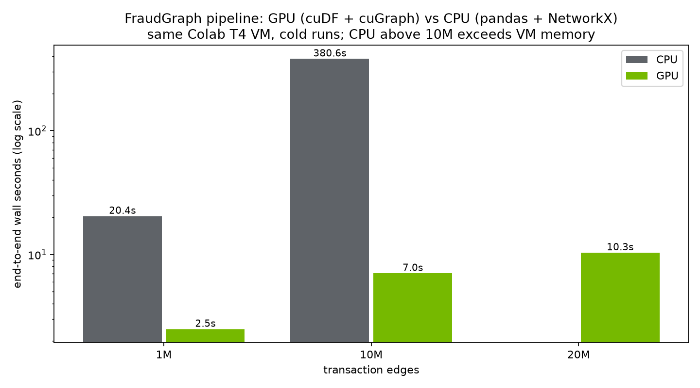

# FraudGraph

Fraud rings don't look like fraud one transaction at a time. A mule account
receiving forty small transfers looks like a shopkeeper; a laundering loop looks
like friends paying each other back. The pattern only shows up when you look at
the *graph* — and running graph algorithms over millions of transactions on a CPU
is too slow for a same-day freeze decision.

FraudGraph does two things about that:

1. **Detects rings on a GPU.** cuDF + cuGraph turn a 10M-edge transaction graph
   into a risk-ranked queue of fraud rings in about 7 seconds. The same pipeline
   in pandas + NetworkX takes over 6 minutes on the same machine.
2. **Investigates them with agents.** An ADK workflow (Gemini 2.5 Flash on
   Vertex AI) triages the queue, pulls the evidence out of BigQuery through
   parameterized SQL tools, and writes a SAR-style case file where every claim
   cites a real transaction ID. A human analyst approves, rejects or escalates —
   the agent never acts on its own.

**Live console:** https://fraudgraph-console-vy4hk24zgq-el.a.run.app
(Cloud Run, scales to zero — first load after idle takes ~20s)

Built solo for the Google Gen AI Academy APAC Cohort 2 hackathon, Problem
Statement 2 (NVIDIA acceleration track).

## Results

Benchmark on a Colab T4 VM — its own CPU vs its own GPU, cold runs, identical
logical operations on both engines. Full per-stage rows live in the
`benchmarks` BigQuery table; the notebook that produced them is in this repo.

| edges | GPU (cuDF + cuGraph) | CPU (pandas + NetworkX) | speedup |
|------:|---------------------:|------------------------:|--------:|
|    1M |                 2.5s |                    20.4s |      8× |
|   10M |                 7.0s |                   380.6s |     54× |
|   20M |                10.3s |     exceeds VM memory    |       — |

Detection quality, measured against the generator's ground-truth labels:
**precision 0.92, recall 0.40** at the default risk threshold. Precision is what
matters operationally — when the console flags a ring, it is almost always real.
Recall is bounded by a known limitation: dispersal-mule accounts connect to a
shared source rather than to each other, so community detection alone can't see
them as a group. That's the first thing I'd attack with more time.

One implementation note worth knowing: cuGraph's Louvain collapses to singleton
communities on this graph (a handful of merchant super-hubs dominate the
modularity term). Ring detection therefore uses **Leiden** on a hub-pruned graph,
which was built to fix exactly that failure mode. Louvain still gets benchmarked
on both engines since it's the standard like-for-like comparison.



## Architecture


- **Google Cloud:** BigQuery (single source of truth for transactions, rings,
  case files and decisions), Cloud Storage (Parquet data lake), Cloud Run
  (console), Vertex AI (Gemini 2.5 Flash)
- **NVIDIA:** cuDF for the ETL/feature stage, cuGraph for WCC / Louvain /
  PageRank / Leiden, on a T4
- **Agents:** google-adk 2.3 workflow (triage → investigator → case-file →
  human approval as a workflow interrupt), with MCP Toolbox for Databases as
  the tool layer — the agents can only run the four parameterized queries in
  [app/agents/tools.yaml](app/agents/tools.yaml), nothing else

The case-file agents are deliberately boxed in: every factual claim must cite a
txn_id or account_id returned by a tool call, and the runner re-checks every
cited ID against BigQuery before a case file can be persisted. A file citing a
transaction that doesn't exist gets rejected.

## Data

All data is synthetic, produced by [generator/generate.py](generator/generate.py).
Background traffic follows realistic shapes — power-law account activity,
log-normal amounts, day/night and weekly rhythm, a UPI-like channel mix — with
five fraud topologies injected on top: smurfing fan-in, dispersal fan-out,
cyclic laundering rings, mule chains, and dormant-burst accounts. Distributions
are modeled on PaySim (Lopez-Rojas, Elmir & Axelsson, 2016); no PaySim data is
included.

Real transaction data is essentially never public, which is why this domain
standardizes on synthetic generation. Controlling the generator also means the
fraud is labelled, so the precision/recall numbers above are measured, not
estimated. None of the amounts or rates here represent real-world statistics.

## Running it yourself

```bash
pip install -r requirements.txt

# 1. Generate a transaction graph (any machine, no GPU needed; 1M edges ~ 2s)
python generator/generate.py --edges 1e6 --out data/1m --seed 42

# 2. GPU pipeline + benchmark: open notebooks/01_gpu_pipeline_benchmark.ipynb
#    on Colab with a T4 runtime and run top to bottom. DATA_SOURCE="generate"
#    works without any GCP setup.

# 3. GCP setup (BigQuery dataset + tables, bucket, service account)
export PROJECT_ID=<project> BUCKET=<unique-bucket-name>
bash infra/setup.sh
gcloud storage cp -r data/1m gs://$BUCKET/raw/1m
SCALE=1m bash infra/load_bq.sh

# 4. Agents, locally (needs the MCP Toolbox server + Vertex AI access)
export FRAUDGRAPH_PROJECT_ID=<project>
toolbox --config app/agents/tools.yaml --enable-api &
python app/agents/run_fraud_desk.py            # investigates the top ring

# 5. Console, locally
streamlit run app/console/streamlit_app.py
```

Deploying the console is one command from the repo root:

```bash
gcloud run deploy fraudgraph-console --source . --region asia-south1 \
  --allow-unauthenticated --memory 1Gi
```

## Repo layout

```
generator/generate.py                     synthetic transaction-graph generator
notebooks/01_gpu_pipeline_benchmark.ipynb GPU pipeline + CPU-vs-GPU benchmark
app/agents/                               ADK workflow, tools.yaml, CLI runner
app/console/streamlit_app.py              analyst console (Cloud Run)
infra/                                    BigQuery DDL + one-shot setup scripts
assets/                                   architecture diagram, benchmark chart
Dockerfile                                console + toolbox container
```

## License

MIT — see [LICENSE](LICENSE).
