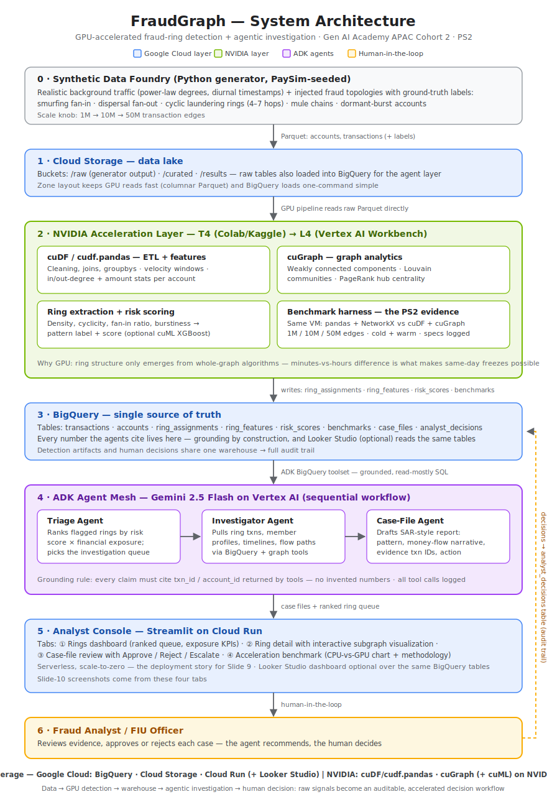

# FraudGraph 🕸️

**GPU-accelerated fraud-ring detection with an agentic investigation desk.**
cuGraph finds the rings hiding in millions of transactions in seconds; ADK 2.x agents
investigate them and draft evidence-grounded case files; a human analyst approves the
action.

> 🔗 **Live demo:** _Cloud Run URL — added at deploy (Phase 3)_
> 🎥 **Demo video:** _link added at submission (Phase 4)_

Built solo for **Google GenAI Academy APAC Cohort 2 — Problem Statement 2 (NVIDIA)**.

## The problem

Fraud rings — smurfing collectors, mule chains, cyclic laundering loops — are
structurally invisible to per-transaction rules: every individual transfer looks
harmless. The ring only appears at the **graph** level, and whole-graph algorithms on
CPU are too slow for same-day decisions at real transaction volumes. Detection is
commodity; **analyst investigation throughput is the real bottleneck** — turning a
flagged ring into an evidence-cited, reviewable case file takes hours per ring.

## What FraudGraph does

1. **Synthetic Data Foundry** (`generator/`) — transaction graphs at 1M/10M/50M edges:
   PaySim-seeded background traffic (power-law degrees, log-normal amounts, diurnal
   rhythm) + five injected fraud topologies with ground-truth labels.
2. **GPU detection pipeline** (`notebooks/`) — cuDF ETL → cuGraph WCC/Louvain/PageRank
   → ring features → risk-ranked rings, with an honest CPU-vs-GPU benchmark harness
   (same VM, cold+warm, DNFs recorded as DNFs).
3. **Agent mesh** (`app/agents/`) — ADK 2.x Workflow: Triage → Investigator →
   Case-File → **human-in-the-loop approval node**, grounded in BigQuery via
   MCP Toolbox parameterized-SQL tools. Every claim cites a real txn_id.
4. **Analyst console** (`app/console/`) — Streamlit on Cloud Run: ring queue,
   subgraph view, case-file review with Approve/Reject/Escalate, benchmark tab.

## Architecture



Stack: **Google Cloud** — BigQuery, Cloud Storage, Cloud Run, Vertex AI (Gemini 2.5
Flash) · **NVIDIA** — cuDF/cudf.pandas, cuGraph on T4/L4.

## Benchmark results

_Filled in Phase 1 from the `benchmarks` table — 1M/10M/50M edges, per-stage
wall-clock, cold+warm, CPU (pandas+NetworkX) vs GPU (cuDF+cuGraph) on the same VM.
Methodology in the notebook; every number rerunnable._

## Quickstart

```bash
# 1. Generate a graph (any machine, no GPU needed)
pip install -r requirements.txt
python generator/generate.py --edges 1e6 --out data/1m --seed 42

# 2. GPU pipeline + benchmark: open notebooks/01_gpu_pipeline_benchmark.ipynb
#    on Colab (T4 runtime) and run top-to-bottom.

# 3. GCP setup (BigQuery dataset, bucket, service account)
export PROJECT_ID=<project> BUCKET=<unique-bucket>
bash infra/setup.sh
gcloud storage cp -r data/1m gs://$BUCKET/raw/1m
SCALE=1m bash infra/load_bq.sh

# 4. Console (local)
FRAUDGRAPH_PROJECT_ID=$PROJECT_ID streamlit run app/console/streamlit_app.py
```

## Data honesty

All data is synthetic, produced by `generator/generate.py`, with PaySim
(Lopez-Rojas, Elmir & Axelsson, 2016) as the *statistical shape reference* — no real
transaction data is used or represented. Ground-truth labels exist because we control
generation; they power honest precision/recall reporting. Framing used throughout:
*architecture validated on industry-standard synthetic data at production scale* —
never real-world fraud results.

## Repo layout

```
generator/generate.py                    # Synthetic Data Foundry
notebooks/01_gpu_pipeline_benchmark.ipynb # GPU pipeline + CPU-vs-GPU benchmark
app/agents/                              # ADK 2.x fraud_desk workflow + tools.yaml
app/console/streamlit_app.py             # Analyst console (Cloud Run)
app/Dockerfile
infra/schemas.sql · setup.sh · load_bq.sh # one-shot GCP setup
assets/                                  # architecture SVG, screenshots, charts
```

## License

MIT — see [LICENSE](LICENSE).
